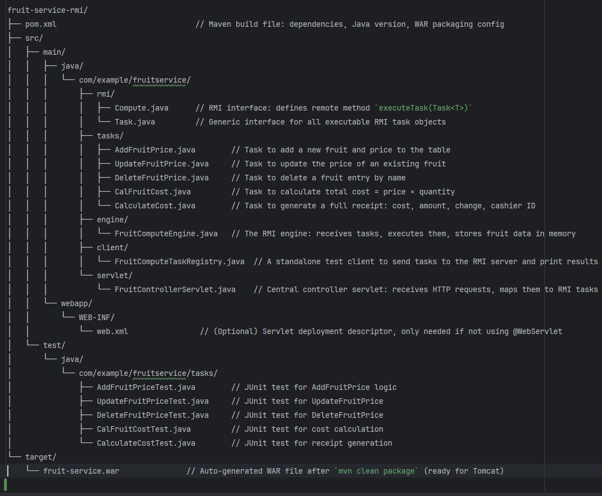

# Fruit Service Engine – Java RMI and Servlet-Based Backend System
Fruit Service Engine – Java RMI and Servlet-Based Backend System

📘 Project Overview
-------------------
This project implements a modular 3-tier Java application for managing fruit pricing and transactions. It includes:

- A backend RMI engine to execute business logic tasks
- A centralized servlet controller to expose API endpoints
- A modular task system for CRUD operations and transactional processing

The design follows a distributed, command-based approach where each task object encapsulates both data and logic.

🧱 System Architecture
----------------------
- **Client Layer**: Sends tasks via RMI or through HTTP to the servlet
- **Servlet Layer**: Translates HTTP requests into RMI tasks and sends them to the backend
- **RMI Engine**: Executes received tasks and returns results

📂 Folder Structure (Maven Layout with File Descriptions)
----------------------------------------------------------


🧠 Modular Tasks Implemented
----------------------------
1. **AddFruitPrice** – Adds a new fruit and price to the fruit-price table.
2. **UpdateFruitPrice** – Updates the price of an existing fruit.
3. **DeleteFruitPrice** – Removes a fruit-price entry.
4. **CalFruitCost** – Multiplies fruit price × quantity and returns the cost.
5. **CalculateCost** – Generates a receipt including:
   - Total cost
   - Amount given
   - Change due
   - Cashier ID
6. **ListFruits** – Lists the Fruits currently present in the systemd

📄 Task Folder Contents
------------------------
Located at: `src/main/java/com/example/fruitservice/tasks/`

Each task is implemented in its own file, following a modular and reusable design:

- AddFruitPrice.java
- UpdateFruitPrice.java
- DeleteFruitPrice.java
- CalFruitCost.java
- CalculateCost.java
- ListFruits.java

Each class:
- Implements `Task<T>` and `Serializable`
- Encapsulates all data and behavior needed to execute the task
- Can be independently tested and reused


## 🚀 How to Run the System

This project consists of three main components:

- **RMI Server:** Manages the fruit-price table and business logic.
- **Servlet Layer (Tomcat):** Acts as the web controller and RMI client.
- **Web Client:** A browser-based interface for interacting with the system.

---

## 🧰 Prerequisites

- Java 21 or later installed
- Apache Tomcat 9+ installed and running
- Both `fruit-service-rmi` (RMI server) and `my-app-0.0.1-SNAPSHOT` (web app) built and deployed
- All users/computers must be on the same local network for shared access

---

## 🟢 Step 1: Start the RMI Server

```bash
cd path/to/fruit-service-rmi
```

Start the RMI registry (if not embedded in code):

### Windows:
```bash
start rmiregistry 1099
```

### macOS/Linux:
```bash
rmiregistry 1099 &
```

Then start the RMI server:

```bash
java -cp . com.example.fruitservice.engine.FruitComputeEngine
```

*(Replace with your actual main class if different)*

---

## 🌐 Step 2: Deploy and Start the Web Application

1. Build your web app using Maven.
2. Deploy to Tomcat’s `webapps` directory:

```bash
C:\apache-tomcat-9.0.106\webapps\my-app-0.0.1-SNAPSHOT\
```

3. Start Tomcat.
4. Access the deployed app via browser:

```
http://localhost:8080/my-app-0.0.1-SNAPSHOT/
```

---

## 💻 Step 3: Access the Web Client

### On your local machine:
[http://localhost:8080/my-app-0.0.1-SNAPSHOT/](http://localhost:8080/my-app-0.0.1-SNAPSHOT/)

### From another computer on the same network:

```bash
http://<your-ip>:8080/my-app-0.0.1-SNAPSHOT/
```

Find your IP via:

```bash
ipconfig  # Windows
ifconfig  # Mac/Linux
```

Ensure ports **8080 (Tomcat)** and **1099 (RMI)** are open in your firewall.

---

## 🛠️ Step 4: Using the System

- Use the UI to **add/update/delete fruits, calculate costs, and print receipts**.
- All users see a **shared, real-time fruit list** from the RMI backend.

---


## 🧹 Shutting Down

- Stop both Tomcat and the RMI server.
- The fruit list is in memory and will reset after server restart.

---

## 🧾 Quick Reference Table

| Component         | Start Command |
|------------------|----------------|
| RMI Server        | `java -cp . com.example.fruitservice.engine.FruitComputeEngine` |
| Tomcat/Web Server | `startup.bat` / `startup.sh` |
| Web Client        | `http://<your-ip>:8080/my-app-0.0.1-SNAPSHOT/` |


🔄 GitHub Workflow
------------------
- `main` – Production-ready code
- `rmi-engine` – Compute engine and task registry
- `servlet-layer` – Servlet controller work
- `client-tester` – RMI test client
- `build-deploy` – WAR packaging, Tomcat config

📌 Technologies Used
---------------------
- Java 24 and Java 21
- Apache Maven
- Javax Servlet API 
- Tomcat 9 (stable)
- Java RMI (Remote Method Invocation)

📦 Build Output
---------------
→ target/fruit-service.war (deploy this to Tomcat)

👥 Contributors
---------------
- Developer 1: Aicha Zindamoyen
- Developer 2: David Gathage
