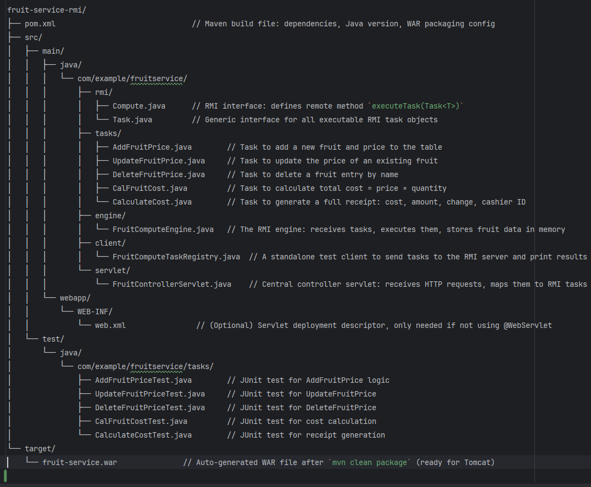

# Fruit Service Engine – Java RMI and Servlet-Based Backend System
Fruit Service Engine – Java RMI and Servlet-Based Backend System

📘 Project Overview
-------------------
This project implements a modular 3-tier Java application for managing fruit pricing and transactions. It includes:

- A backend RMI engine to execute business logic tasks
- A centralized servlet controller to expose API endpoints
- A modular task system for CRUD operations and transactional processing

The design follows a distributed, command-based approach where each task object encapsulates both data and logic.

🧱 System Architecture
----------------------
- **Client Layer**: Sends tasks via RMI or through HTTP to the servlet
- **Servlet Layer**: Translates HTTP requests into RMI tasks and sends them to the backend
- **RMI Engine**: Executes received tasks and returns results

📂 Folder Structure (Maven Layout with File Descriptions)
----------------------------------------------------------

🧠 Modular Tasks Implemented
----------------------------
1. **AddFruitPrice** – Adds a new fruit and price to the fruit-price table.
2. **UpdateFruitPrice** – Updates the price of an existing fruit.
3. **DeleteFruitPrice** – Removes a fruit-price entry.
4. **CalFruitCost** – Multiplies fruit price × quantity and returns the cost.
5. **CalculateCost** – Generates a receipt including:
   - Total cost
   - Amount given
   - Change due
   - Cashier ID

📄 Task Folder Contents
------------------------
Located at: `src/main/java/com/example/fruitservice/tasks/`

Each task is implemented in its own file, following a modular and reusable design:

- AddFruitPrice.java
- UpdateFruitPrice.java
- DeleteFruitPrice.java
- CalFruitCost.java
- CalculateCost.java

Each class:
- Implements `Task<T>` and `Serializable`
- Encapsulates all data and behavior needed to execute the task
- Can be independently tested and reused

🧪 How to Run the System
-------------------------
1. **Start the RMI registry** (optional if embedded):
   > start rmiregistry

2. **Run the RMI engine**:
   > java com.example.fruitservice.engine.FruitComputeEngine

3. **Package and deploy WAR**:
   > mvn clean package
   → Copy `target/fruit-service.war` to `TOMCAT_HOME/webapps/`

4. **Start Tomcat** and test API with:
   > http://localhost:8080/fruit-service/fruitService?action=addFruit&fruitName=Mango&price=40.0

🧪 Sample API Actions (Servlet Endpoints)
----------------------------------------
- Add fruit:
  /fruitService?action=addFruit&fruitName=Apple&price=50

- Update fruit:
  /fruitService?action=updateFruit&fruitName=Apple&newPrice=60

- Delete fruit:
  /fruitService?action=deleteFruit&fruitName=Apple

- Calculate cost:
  /fruitService?action=calculateCost&fruitName=Apple&quantity=3

- Print receipt:
  /fruitService?action=printReceipt&fruitName=Apple&quantity=3&amountGiven=500&cashierId=Z123

🔄 GitHub Workflow
------------------
- `main` – Production-ready code
- `rmi-engine` – Compute engine and task registry
- `servlet-layer` – Servlet controller work
- `client-tester` – RMI test client
- `build-deploy` – WAR packaging, Tomcat config

📌 Technologies Used
---------------------
- Java 24 and Java 21
- Apache Maven
- Jakarta Servlet API 5.0
- Tomcat 10+
- Java RMI (Remote Method Invocation)

📦 Build Output
---------------
→ target/fruit-service.war (deploy this to Tomcat)

👥 Contributors
---------------
- Developer 1: Aicha
- Developer 2: David
